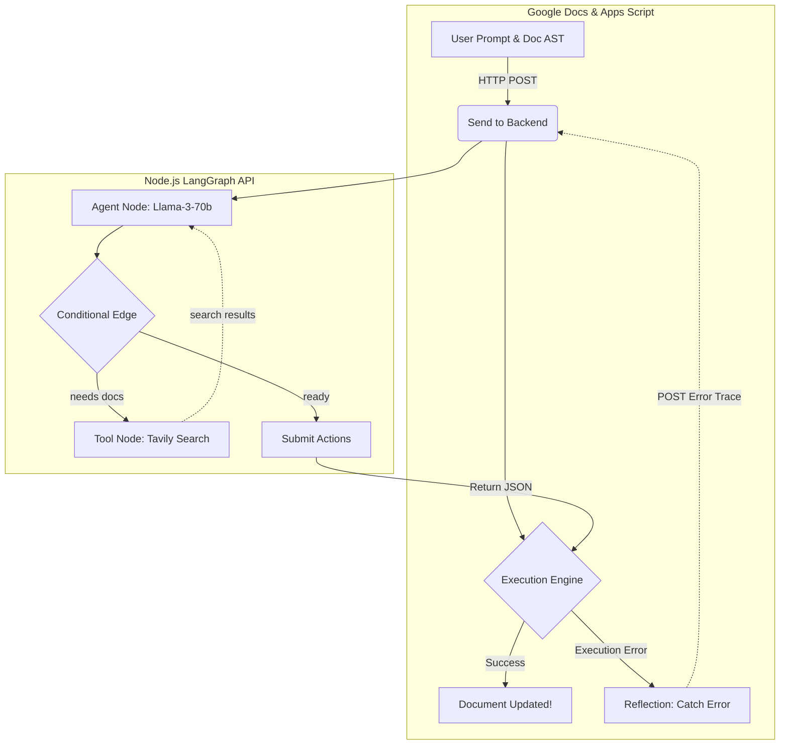

# DocPilot: Autonomous Agentic Document Editor

DocPilot is an experimental Google Docs AI assistant. It doesn't just generate text—it autonomously controls the document's structure and formatting using a self-healing agentic workflow.

## 🚀 Key Features

* **Agentic Architecture (LangGraph):** Uses a ReAct (Reasoning + Acting) loop. The AI decides if it needs to search the web for documentation or if it's ready to execute actions.
* **Autonomous Web Search (Tavily):** When the AI encounters an unknown Google Apps Script method, it pauses, searches the official `developers.google.com` documentation, and learns the method in real-time.
* **Self-Healing Loop:** If Google Apps Script crashes while executing the AI's commands, the execution engine catches the error and sends the exact stack trace back to the AI. The AI reflects on its mistake, searches the web if necessary, and tries again (up to 3 times).
* **Dynamic Execution Engine:** Parses and executes dynamic JavaScript methods directly inside Google Docs, including the ability to seamlessly parse and evaluate Google Apps Script Enums (e.g., `DocumentApp.HorizontalAlignment.CENTER`) generated by the LLM.

## 🧠 Architecture Overview

DocPilot is split into a "Brain" (Node.js Backend) and "Hands" (Google Apps Script Frontend). 



## 🛠️ Setup & Installation

### 1. Backend Setup
The brain of the operation lives in the `backend/` folder.

1. Navigate to the backend directory: `cd backend`
2. Install dependencies: `npm install`
3. Create a `.env` file with your API keys:
   ```env
   GROQ_API_KEY=your_groq_api_key
   TAVILY_API_KEY=your_tavily_api_key
   ```
4. Start the server: `node server.js`
5. *(Optional)* Expose the server to the public internet using LocalTunnel or Cloudflare so Google Docs can reach it.

### 2. Frontend Setup (Google Apps Script)
The hands of the operation live in the `src/` folder.

1. Enable the **Google Apps Script API** in your [Google Apps Script Settings](https://script.google.com/home/usersettings).
2. Login to Clasp: `npm run login`
3. Create the Google Doc project: `npm run create`
4. Push the code: `npm run push`
5. Open the document: `npm run open`

### 3. Usage
1. Inside the Google Doc, click the **DocPilot > Send to Backend** menu item.
2. Type a command like *"Center all normal text and make the titles red."*
3. Watch your Node.js console to see the Agent's reasoning, search loop, and self-healing process in action!
