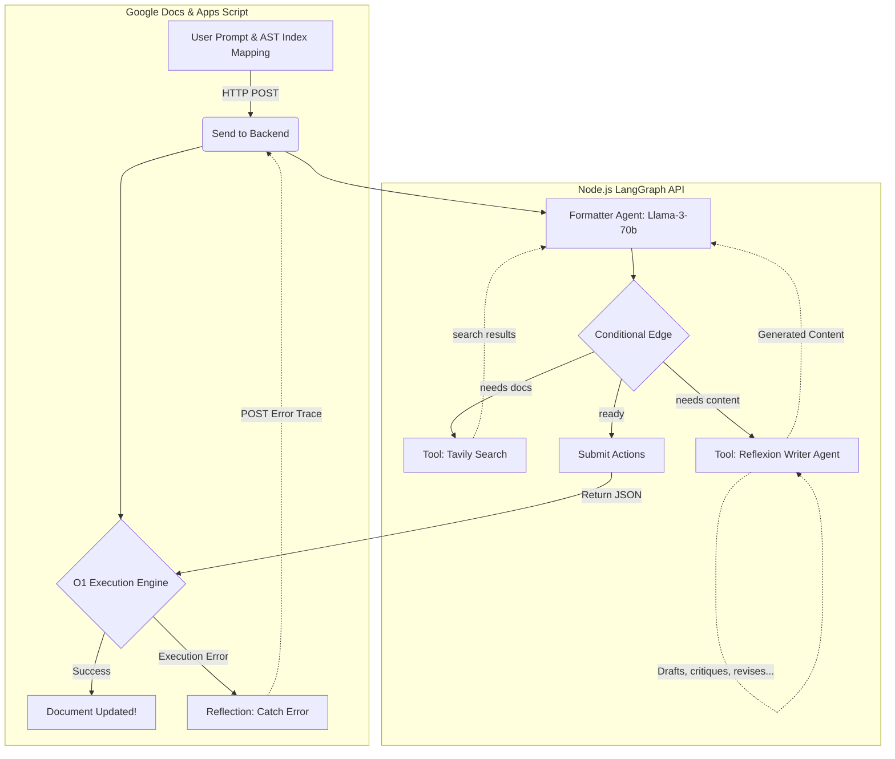
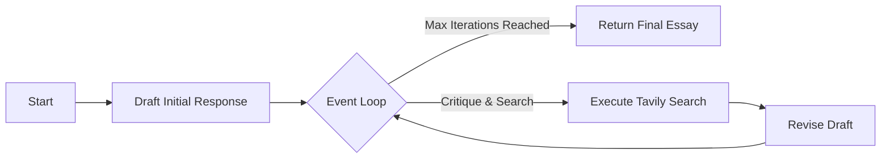

# DocPilot: Autonomous Agentic Document Editor

DocPilot is an experimental Google Docs AI assistant. It doesn't just generate text—it autonomously controls the document's structure, generates rich content via a Reflexion agent, and formats using a self-healing agentic workflow.

## 🚀 Key Features

* **Super Agent Architecture:** Uses a dual-agent system. The main **Formatter Agent** (LangGraph) reasons about document structure, while a secondary **Writer Agent** (a Reflexion loop) handles researching and drafting new content.
* **Granular Target Mapping:** Unlike standard editors, DocPilot extracts the entire Google Docs Abstract Syntax Tree (AST), assigning a global index to every single Paragraph, List Item, and Table. This gives the AI surgical precision to target specific elements.
* **Self-Healing Loop:** If Google Apps Script crashes while executing the AI's commands, the $O(1)$ execution engine catches the error and sends the exact stack trace back to the AI. The AI reflects on its mistake, searches the web if necessary, and tries again.
* **Autonomous Web Search (Tavily):** When the AI encounters an unknown Google Apps Script method or needs to research a topic to write about, it pauses, searches the web, and learns in real-time.
* **Dynamic Execution Engine:** Safely parses and executes dynamic JavaScript methods directly inside Google Docs, including the ability to evaluate Google Apps Script Enums (e.g., `DocumentApp.HorizontalAlignment.CENTER`) and intelligently switch between Container vs Text methods.

## 🧠 Architecture Overview

DocPilot is split into a "Brain" (Node.js Backend) and "Hands" (Google Apps Script Frontend). 



### The Reflexion Writer Agent
When the Formatter Agent decides it needs to generate new content, it invokes the Writer Agent. The Writer Agent uses its own dedicated LangGraph loop to ensure high-quality output before handing it back to the Formatter.



## 🛠️ Setup & Installation

### 1. Backend Setup
The brain of the operation lives in the `backend/` folder.

1. Navigate to the backend directory: `cd backend`
2. Install dependencies: `npm install`
3. Create a `.env` file with your API keys:
   ```env
   GROQ_API_KEY=your_groq_api_key
   TAVILY_API_KEY=your_tavily_api_key
   ```
4. Start the server: `node server.js`
5. *(Optional)* Expose the server to the public internet using LocalTunnel or Cloudflare so Google Docs can reach it.

### 2. Frontend Setup (Google Apps Script)
The hands of the operation live in the `src/` folder.

1. Enable the **Google Apps Script API** in your [Google Apps Script Settings](https://script.google.com/home/usersettings).
2. Login to Clasp: `npm run login`
3. Create the Google Doc project: `npm run create`
4. Push the code: `npm run push`
5. Open the document: `npm run open`

### 3. Usage
1. Inside the Google Doc, click the **DocPilot > Send to Backend** menu item.
2. Type a command like *"Write a 250-word essay about AI startups, make the title bold, and change the first paragraph to red."*
3. Watch your Node.js console to see the two Agents coordinating, searching, revising, and executing!
