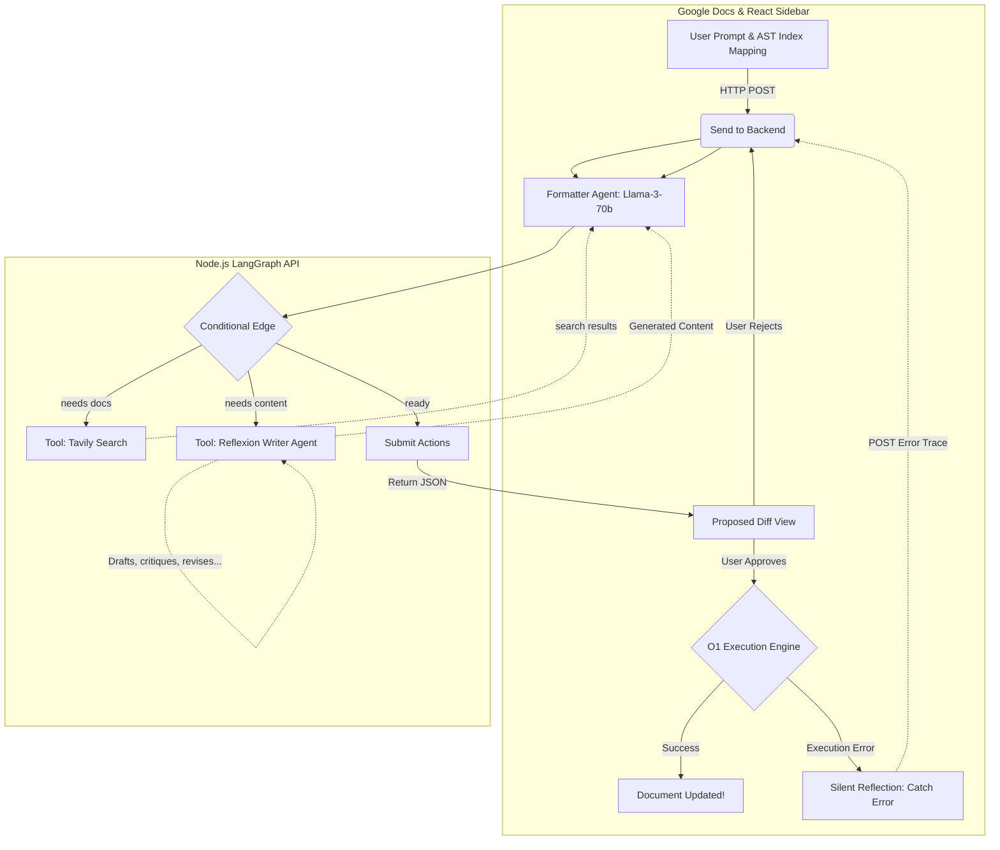
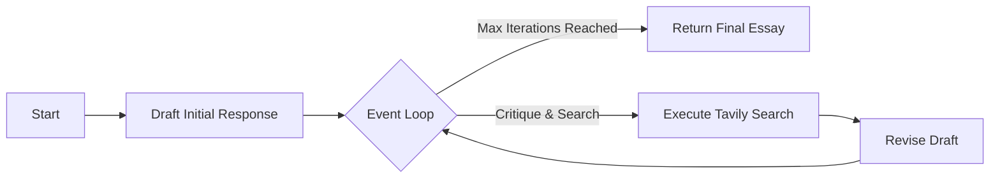

# DocPilot: Autonomous Agentic Document Editor

DocPilot is an experimental Google Docs AI assistant. It doesn't just generate text—it autonomously controls the document's structure, generates rich content via a Reflexion agent, and formats using a self-healing agentic workflow.

## 🚀 Key Features

* **Super Agent Architecture:** Uses a dual-agent system. The main **Formatter Agent** (LangGraph) reasons about document structure, while a secondary **Writer Agent** (a Reflexion loop) handles researching and drafting new content.
* **React Sidebar UI:** A beautiful, responsive, and persistent React interface built with Vite and injected directly into Google Docs via `vite-plugin-singlefile`.
* **Human-in-the-Loop (Diff View):** The AI does not blindly execute code. It presents a "Proposed Actions" diff card in the UI, allowing you to Approve or Reject its exact target indices and formatting methods before any Google Docs mutations occur.
* **Silent Self-Healing Loop:** If an approved execution fails, the React frontend silently captures the stack trace and sends it back to the backend. The AI reflects, searches the web, and returns a corrected Diff View—without ever polluting the chat UI.
* **Backend JSON Retry Logic:** The Node.js server employs a robust retry system that detects when the Llama-3 model hallucinates malformed JSON (e.g. `tool_use_failed` errors) and dynamically updates the system prompt on the fly to force the LLM to correct its bracket syntax, breaking deterministic failure loops.
* **Granular Target Mapping:** Extracts the entire Google Docs Abstract Syntax Tree (AST), assigning a global index to every single Paragraph, List Item, and Table.
* **Autonomous Web Search (Tavily):** When the AI encounters an unknown Google Apps Script method or needs to research a topic to write about, it pauses, searches the web, and learns in real-time.

## 🧠 Architecture Overview

DocPilot is split into a "Brain" (Node.js Backend) and "Hands" (Google Apps Script Frontend). 



### The Reflexion Writer Agent
When the Formatter Agent decides it needs to generate new content, it invokes the Writer Agent. The Writer Agent uses its own dedicated LangGraph loop to ensure high-quality output before handing it back to the Formatter.



## 🛠️ Setup & Installation

### 1. Backend Setup
The brain of the operation lives in the `backend/` folder.

1. Navigate to the backend directory: `cd backend`
2. Install dependencies: `npm install`
3. Create a `.env` file with your API keys:
   ```env
   GROQ_API_KEY=your_groq_api_key
   TAVILY_API_KEY=your_tavily_api_key
   ```
4. Start the server: `node server.js`
5. *(Optional)* Expose the server to the public internet using LocalTunnel or Cloudflare so Google Docs can reach it.

### 2. Frontend Setup (React Sidebar & Apps Script)
The hands of the operation live in the `frontend/` and `src/` folders.

1. Enable the **Google Apps Script API** in your [Google Apps Script Settings](https://script.google.com/home/usersettings).
2. Login to Clasp: `npm run login`
3. Build the React App: `cd frontend && npm install && npm run build:gas`
4. Create the Google Doc project: `cd .. && npm run create`
5. Push the code: `npm run push`
6. Open the document: `npm run open`

### 3. Usage
1. Inside the Google Doc, click the **DocPilot > Open DocPilot Copilot** menu item to open the React Sidebar.
2. Type a command in the sleek chat interface like *"Write a 250-word essay about AI startups, make the title bold, and change the first paragraph to red."*
3. Watch the AI coordinate, research, and present a **Proposed Actions (Diff View)** card.
4. Click **Approve** to execute the changes!
